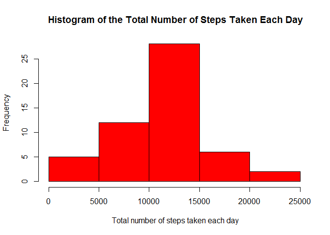

# Reproducible Research: Peer Assessment 1

#### Yuhua Zhang
#### June 12, 2015


## Introduction

It is now possible to collect a large amount of data about personal movement using activity monitoring devices such as a Fitbit, Nike Fuelband, or Jawbone Up. These type of devices are part of the "quantified self" movement -- a group of enthusiasts who take measurements about themselves regularly to improve their health, to find patterns in their behavior, or because they are tech geeks. But these data remain under-utilized both because the raw data are hard to obtain and there is a lack of statistical methods and software for processing and interpreting the data.

This assignment makes use of data from a personal activity monitoring device. This device collects data at 5 minute intervals through out the day. The data consists of two months of data from an anonymous individual collected during the months of October and November, 2012 and include the number of steps taken in 5 minute intervals each day.

## Data

The data for this assignment can be downloaded from the course web site:

Dataset: Activity monitoring data [52K]

The variables included in this dataset are:

1.steps: Number of steps taking in a 5-minute interval (missing values are coded as  NA )

2.date: The date on which the measurement was taken in YYYY-MM-DD format

3.interval: Identifier for the 5-minute interval in which measurement was taken

The dataset is stored in a comma-separated-value (CSV) file and there are a total of 17,568 observations in this dataset.


## Loading and preprocessing the data

### 1. Load the data


```r
setwd("C:/Users/Yuhua/Desktop/Data Science/6")
da<-read.csv("activity.csv",header=T,colClasses=c("numeric","character","numeric"))
```

### 2. Transform the data


```r
da$date <- as.Date(da$date, format = "%Y-%m-%d")
da$interval <- as.factor(da$interval)
```

## What is mean total number of steps taken per day?

### 1. Make a histogram of the total number of steps taken each day


```r
subda <- aggregate(steps ~ date, data = da, sum, na.rm = TRUE)
hist(subda$steps, main = " Histogram of the Total Number of Steps Taken Each Day", xlab = " Total number of steps taken each day",ylab="Frequency", col = "red")
```

 

### 2. Calculate the mean and median total number of steps taken per day


```r
mean(subda$steps)
```

```
## [1] 10766.19
```

```r
median(subda$steps)
```

```
## [1] 10765
```

## What is the average daily activity pattern?

### 1. Make a time series plot (i.e.  type = "l" ) of the 5-minute interval (x-axis) and the average number of steps taken, averaged across all days (y-axis)


```r
ts <- tapply(da$steps, da$interval, mean, na.rm = TRUE)
plot(row.names(ts),ts, type = "l", xlab = "5-min interval", ylab = "Average across all Days", main = "Average number of steps taken", col = "red")
```

 

### 2. Answer the question: Which 5-minute interval, on average across all the days in the dataset, contains the maximum number of steps?


```r
max <- which.max(ts)
names(max)
```

```
## [1] "835"
```

The 835th intervals contain the maximum number of steps.

## Imputing missing values

### 1. Calculate the total number of missing values in the dataset


```r
totalna<-sum(is.na(da))
totalna
```

```
## [1] 2304
```

### 2. Filling in all of the missing values in the dataset


```r
avestep <- aggregate(steps ~ interval, data = da, FUN=mean)
repna <- numeric()
for (i in 1:nrow(da)) {
      subda2 <- da[i, ]
      if (is.na(subda2$steps)) {
          step <- subset(avestep, interval == subda2$interval)$steps
     } else {
         step <- subda2$steps
     }
     repna <- c(repna, step)
}
```

### 3.Create a new dataset that is equal to the original dataset but with the missing data filled in


```r
newda<-da
newda$steps<-repna
```

### 4. Make a histogram of the total number of steps taken each day and Calculate and report the mean and median total number of steps taken per day, then calculate the mean and median of steps taken per day


```r
subda3 <- aggregate(steps ~ date, data = newda, sum, na.rm = TRUE)
hist(subda3$steps, main = " Histogram of the Total Number of Steps Taken Each Day", xlab = " Total number of steps taken each day",ylab="Frequency", col = "red")
```

 

```r
mean(subda3$steps)
```

```
## [1] 10766.19
```

```r
median(subda3$steps)
```

```
## [1] 10766.19
```
By filling in the missing values, the mean the same as previous one, while the median is a little larger.

## Are there differences in activity patterns between weekdays and weekends?

### 1. Create a new factor variable in the dataset with two levels -- "weekday" and "weekend" indicating whether a given date is a weekday or weekend day


```r
day<-weekdays(da$date)
daylevel <- vector()
for (i in 1:nrow(da)) {
     if (day[i] == "Saturday") {
        daylevel[i] <- "Weekend"
    } else if (day[i] == "Sunday") {
        daylevel[i] <- "Weekend"
    } else {
        daylevel[i] <- "Weekday"
    }
}
da$daylevel <- daylevel
da$daylevel <- factor(da$daylevel)
```

###  2. Make a panel plot containing a time series plot (i.e.  type = "l" ) of the 5-minute interval (x-axis) and the average number of steps taken, averaged across all weekday days or weekend days (y-axis)


```r
dailysteps<-aggregate(steps ~ interval + daylevel, data = da, FUN="mean")
names(dailysteps) <- c("interval", "daylevel", "steps")
dailysteps$interval=as.numeric(as.character(dailysteps$interval))
library("lattice")
xyplot(steps ~ interval | daylevel, dailysteps, type = "l", layout = c(1, 2), xlab = "Interval", ylab = "Number of steps")
```

 

